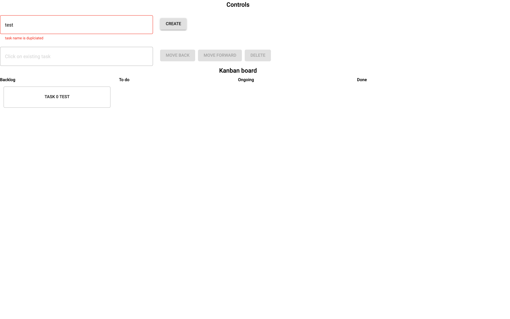

## User Requirements

refer to [./document/userRequirements.md](./document/userRequirements.md)

## UI
1. Login

    
    
2. Create task

    
    
3. Move task

    

## How to run system in localhost
1. install docker 
2. run [./docker/buildSpringModuleDocker.sh](./docker/buildSpringModuleDocker.sh) to build spring module docker image
3. run [./docker/buildWebModuleDocker.sh](./docker/buildWebModuleDocker.sh) to build web module docker image
4. bring up docker system 
    
        docker-compose -f ./docker/docker-compose.yml up
5. open the http://localhost:8080 and login with UID:demo, password: demo    
    
## Spring Module

refer to [./backend/README.md](./backend/README.md)

## Web module

refer to [./frontend/README.md](./frontend/README.md)

