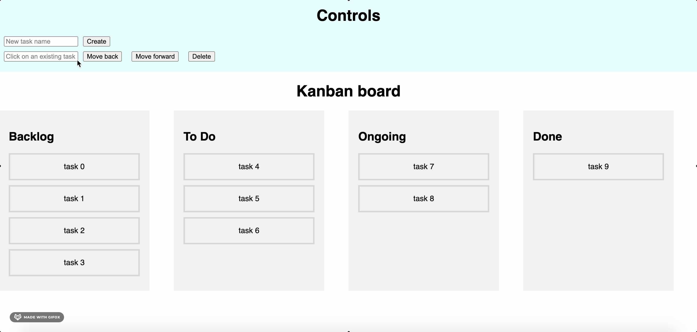
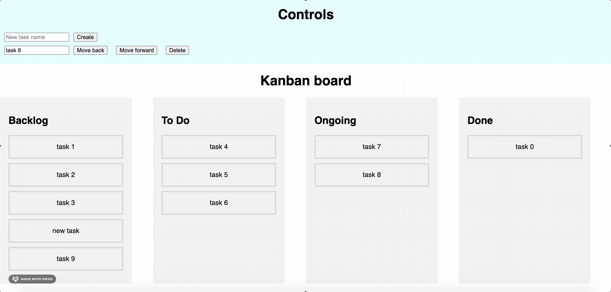
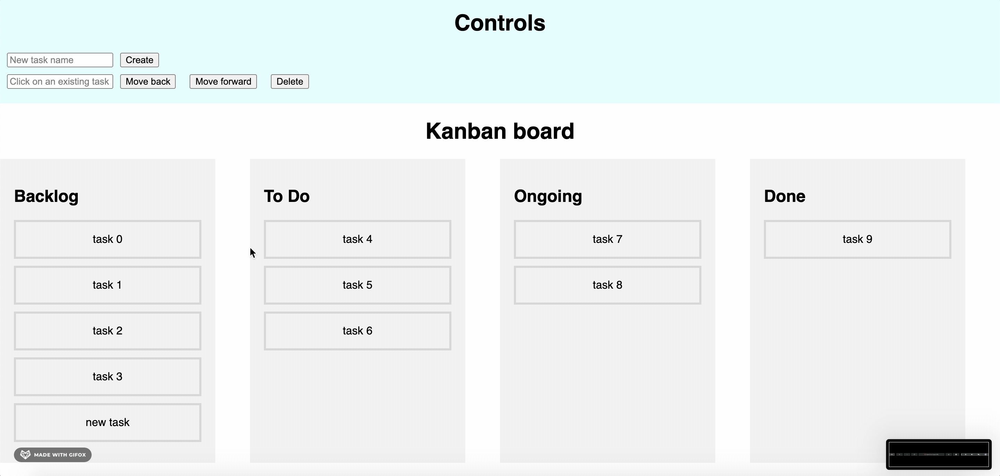
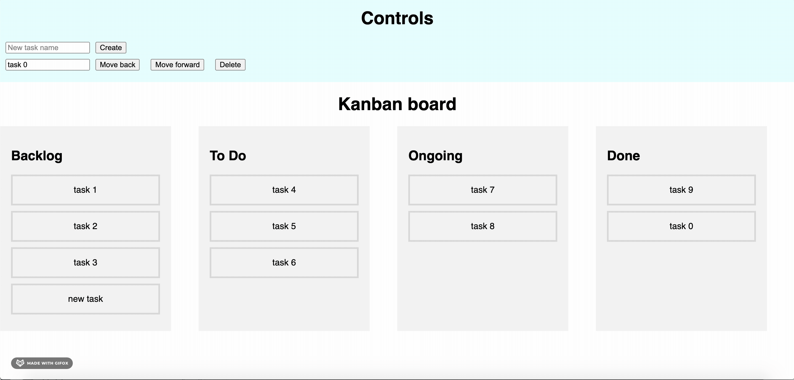

## Overview

You are tasked to build a kanban board on a web application for the development team to manage their development tasks. The kanban board consists of 4 main columns, Backlog, To Do, Ongoing and Done.

Please choose from Frontend or Backend Assignment, End to End full stack solution also welcomed.

Please submit your codebase to GitHub (include commit history and comment) and send back to us.

**Bonus**: A live demo deployment on cloud platform. E.g. AWS, Azure, GCP, Alibaba Cloud or Heroku.

## User Stories for Kanban Board Web Application

| Story                                                                                        | Acceptance Criteria                                                                                                                                                                                                                                                                                                                                                                                        | Required |
| -------------------------------------------------------------------------------------------- | ---------------------------------------------------------------------------------------------------------------------------------------------------------------------------------------------------------------------------------------------------------------------------------------------------------------------------------------------------------------------------------------------------------- | -------- |
| 1. As a user, I am able to log into the application.                                         | User is able to input his username and password into the input field on the login page. User is able to be directed into the kanban board page upon successful login when clicking the submit button. User is able to see error message upon unsuccessful login when clicking the submit button.                                                                                                     | Yes      |
| 2. As a user, I am able to create a new task and the new task will be shown in the backlog   | Given the user is logged in successfully, when the user inputs into 'new task name' field and click create. Then the user should see the task created in the backlog column                                                                                                                                                                                                                                | Yes      |
| 3. As a user, I am able to remove a task from any of the kanban board column                 | Given the user clicks on any task in one of the four column, the task name will be shown in a read-only input field. Given the task name is shown in a read-only input field and the user clicks on delete button, then the user should see the task is removed from the column.                                                                                                                        | Yes      |
| 4. As a user, I am able to move a task forward to the next column in the kanban board.       | Given the user clicks on any task in one of the four column, the task name will be shown in a read-only input field. Given the task name is shown in a read-only input field and the user clicks on a 'Move forward' button, then the task will be moved to the next column. Given the user clicks on a task in the Done (last) column, then the move forward button will be disabled.               | Yes      |
| 5. As a user, I am able to move a task backwards to the previous column in the kanban board. | Given the user clicks on any task in one of the four column, the task name will be shown in a read-only input field. Given the task name is shown in a read-only input field and the user clicks on a 'Move backwards' button, then the task will be moved to the previous column. Given the user clicks on a task in the Backlog (first) column, then the 'Move backwards' button will be disabled. | Yes      |

** Wireframe (User story 2: Creating a task) **

** Wireframe (User story 3: Deleting a task) **

** Wireframe (User story 4: Move a task forward) **

** Wireframe (User story 5: Move a task backwards) **

## Front-end tasks and requirements

-   Build the application in any framework/libraries of your choice (Preferably ReactJS or VueJS but others are also welcome)
-   You are free to mock the data required to develop this application, including login.
-   Feel free to use any third party libraries or starter projects. Choice of third party libraries will also be part of the evaluation.
-   Bonus (Optional):
    Use any testing libraries or framework to test against the acceptance criteria defined in the user stories.
-   Timeline of the assignment is 3 days, please let us know if you need time extension.

## Back-end tasks and requirements

-   Analyze the requirements, design and document the API specifications to support the user stories. Create an endpoint (for example /api/docs) to serve a Swagger UI (or similar) page to display these API specs.
-   Create the APIs as specified in the API specifications you just created. Apart from the API specification page and login endpoint, all other endpoints should be protected (i.e. Only users who have logged in should be able to access these endpoints). Your backend application should be stateless.
-   You may use any in-memory database for this exercise. e.g. H2, sqlite
-   Consider extensibility in your design e.g. How can we make it easy to customize columns in the future
-   Include appropriate validations on incoming API requests
-   Include appropriate logs with appropriate logging tools
-   Include appropriate automated API and unit tests
-   Dockerize your application with a dockerfile such that your application can be run with a simple docker command
-   Include a README to document the following:
-   How to run your application and automated tests (it should be as simple as possible)
-   Assumptions you have made and design considerations
-   How you deal with concurrency and conflicting states
-   Any other things you feel it will be useful for us to know
-   Optional: Everytime a task is created,deleted or moved, make an API call to an external email service to simulate an email notification being sent to manager@email.com. The email service is not real and you may use any way to mock the response of this external email service. The trigger for this email notification should be event-driven.
-   Optional: Include additional security features to protect your application and explain them in the README.
-   Timeline of the assignment is 3 days, please let us know if you need time extension.
